# Real-Time Helmet Detection and Text-to-Video Integration

[](https://www.python.org/)
[](https://pytorch.org/)
[](https://docs.ultralytics.com/)
[](https://huggingface.co/)
[](LICENSE)

An end-to-end Deep Learning pipeline that combines state-of-the-art **Computer Vision (YOLOv11)** for multi-class safety object detection with **Generative AI (Text-to-Video Diffusion Models)** to generate and analyze dynamic traffic scenarios in real time.

---

## 📌 Project Overview

This project consists of two tightly integrated components:
1. **Multi-Class Safety Object Detection**: A customized **YOLOv11** model trained to detect helmets, heads (with/without helmets), motorcycles, bicycles, and riders in dense, complex traffic environments.
2. **Generative Scenario Synthesis & Video Inference**: Generating synthetic traffic and rider videos from natural language prompts using Hugging Face text-to-video diffusion pipelines, followed by automated real-time frame-by-frame inference.

---

## 🎯 Part 1: Helmet & Vehicle Object Detection (YOLOv11)

### 1. Dataset & Annotation Pipeline
- **Base Dataset**: [Kaggle Helmet Detection Dataset](https://www.kaggle.com/datasets/andrewmvd/helmet-detection).
- **Split**: 764 total annotated images (611 Training / 153 Validation).
- **Classes**:
  - `Helmet` (with safety helmet)
  - `Head` (without helmet)
  - `Motorcycle` / `Bicycle`
  - `Person` / `Rider`

#### Sample Annotated Ground-Truth:
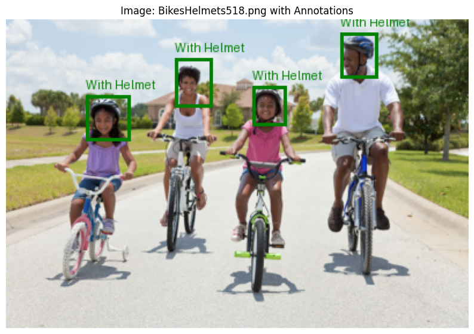

---

### 2. Model Training & Performance
- **Architecture**: **YOLOv11** (Ultralytics implementation)
- **Input Resolution**: $640 \times 640$
- **Optimizer**: AdamW with Cosine Annealing Learning Rate Schedule
- **Epochs**: 100

#### Quantitative Metrics:
| Metric | Score |
| :--- | :---: |
| **mAP@0.5** | **0.83** |
| **mAP@0.5:0.95** | **0.52** |
| **Precision** | **0.80** |
| **Recall** | **0.80** |

#### Training Loss & Metric Curves:
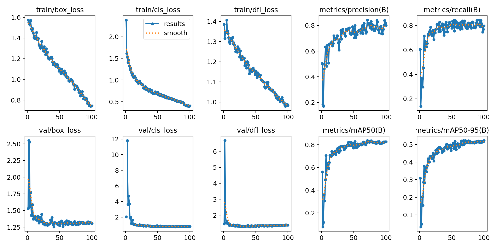

#### Class Performance & Confusion Matrix:
| Confusion Matrix (Normalized) | Precision-Recall (PR) Curve |
| :---: | :---: |
| 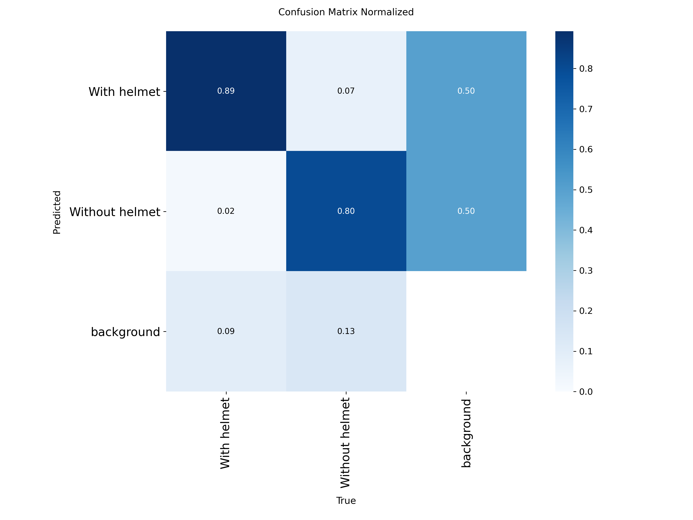 | 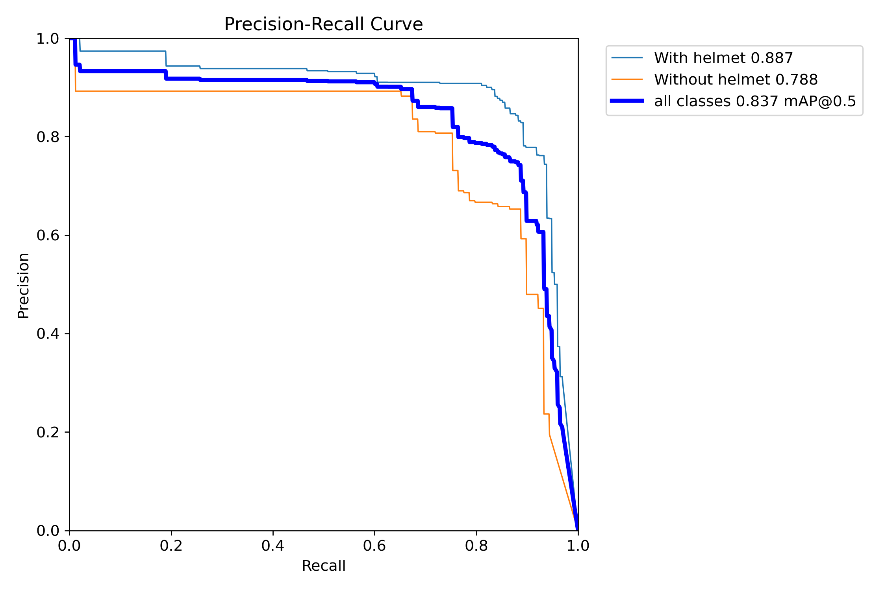 |

#### Validation Batch Predictions:
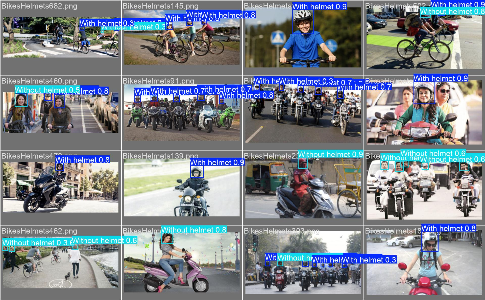

---

## 🎬 Part 2: Generative Text-to-Video & Automated Detection Pipeline

### 1. Synthetic Video Generation
Using Hugging Face's `damo-vilab/text-to-video-ms-1.7b` diffusion model, synthetic video clips are generated directly from natural language prompts:
- *"A motorcyclist wearing a helmet riding a motorcycle on a highway"*
- *"A person on a motorcycle with safety helmet driving through the city"*
- *"Motorcyclist with protective helmet riding a sports bike on a road"*

#### Generated Video Frames:
| Scene 1 (Highway) | Scene 2 (City) |
| :---: | :---: |
| 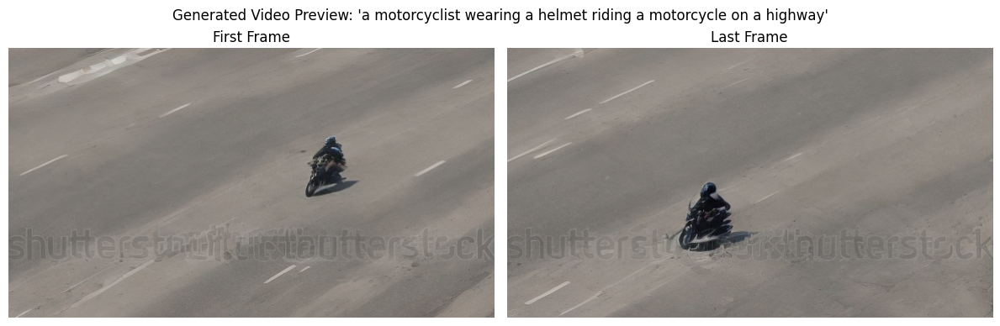 | 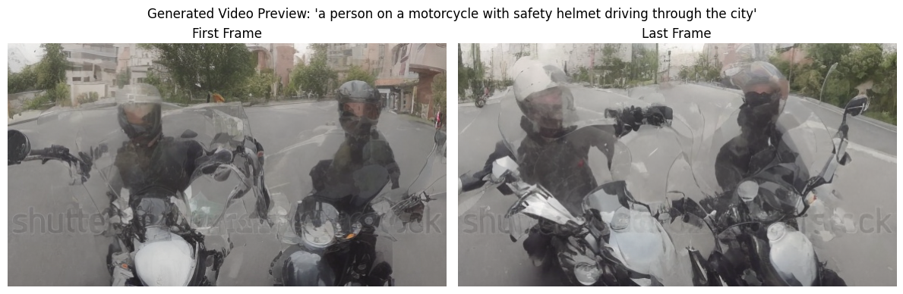 |

| Scene 3 (Sports Bike) | Scene 4 (Traffic) |
| :---: | :---: |
| 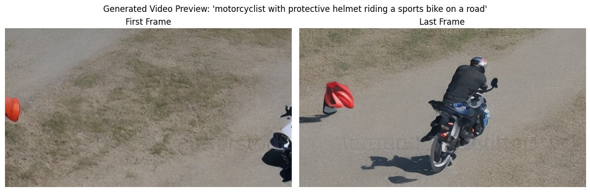 | 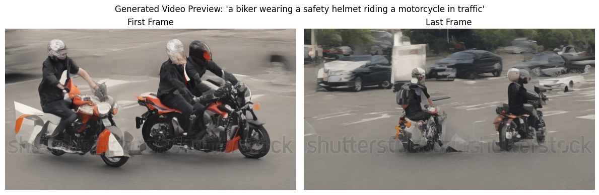 |

---

### 2. Side-by-Side Video Inference Comparison
The trained YOLOv11 detector performs real-time inference across all generated video frames, accurately identifying riders and helmets throughout dynamic motions:

#### Scenario 1: Highway Cruiser
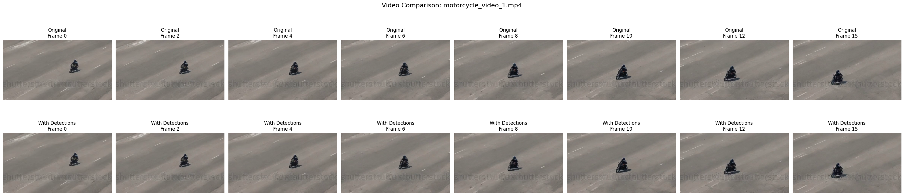

#### Scenario 2: City Commute
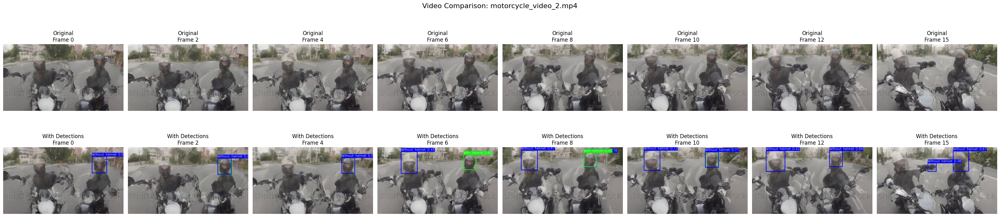

#### Scenario 3: Sports Bike
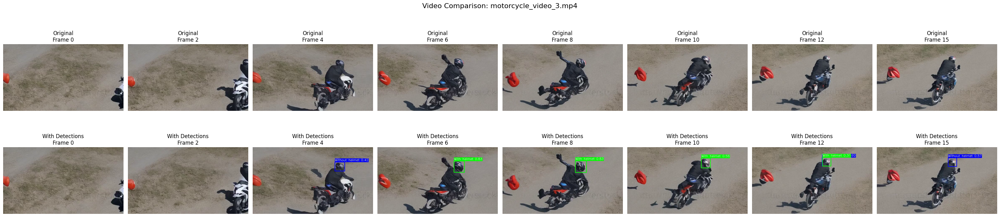

#### Scenario 4: Urban Traffic
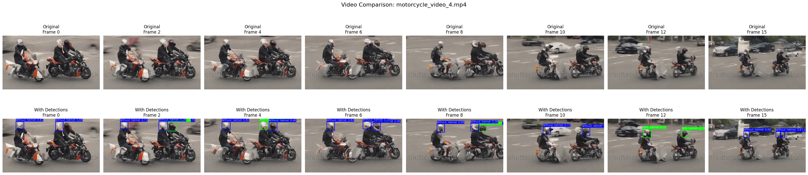

---

## 📁 Repository Structure

```
Helmet_Detection_Text_to_Video/
├── helmet_detection_yolo.ipynb  # Comprehensive Notebook (Data Prep, Training, GenAI & Video Inference)
├── README.md                    # Project documentation & benchmark report
├── LICENSE                      # MIT Open-Source License
├── .gitignore                   # Standard DL/PyTorch ignore rules
└── results/                     # Quantitative metric plots & qualitative comparison grids
    ├── dataset_annotation_sample.png
    ├── training_curves.png
    ├── confusion_matrix_normalized.png
    ├── box_pr_curve.png
    ├── val_batch_predictions.jpg
    ├── text_to_video_sample_1.png ... 4.png
    └── video_detection_comparison_1.png ... 5.png
```

---

## 🚀 Getting Started

### 1. Installation
Clone the repository and install dependencies:
```bash
pip install ultralytics diffusers transformers accelerate opencv-python imageio matplotlib
```

### 2. Running the Complete Pipeline
Open the notebook in Jupyter Notebook or Google Colab:
```bash
jupyter notebook helmet_detection_yolo.ipynb
```
Follow the step-by-step cells to:
1. Load dataset & inspect annotations.
2. Fine-tune / evaluate the YOLOv11 model.
3. Synthesize videos via Hugging Face diffusion models.
4. Run automated video inference and export comparison grids.
